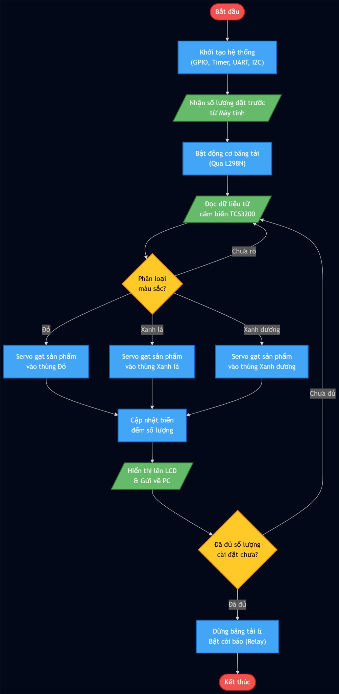

# HỆ THỐNG BĂNG CHUYỀN PHÂN LOẠI MÀU – BARE-METAL STM32

Hệ thống băng chuyền phân loại màu sắc chạy trên nền tảng STM32 theo phương pháp lập trình thanh ghi trực tiếp (Bare-metal).

## 1. Tổng quan dự án

Dự án này triển khai hệ thống phân loại màu sắc tự động trên vi điều khiển STM32.
Hệ thống nhận dữ liệu màu RGB từ cảm biến TCS3200, và điều khiển động cơ DC băng chuyền thông qua driver L298N tích hợp băm xung PWM.

Tương tác người dùng được thực hiện qua giao tiếp UART để cài đặt chỉ tiêu số lượng, trong khi hệ thống liên tục cập nhật số đếm lên màn hình LCD1602 giao tiếp I2C.
Khi đạt đủ số lượng chỉ tiêu phân loại, một relay phần cứng sẽ tự động cắt nguồn cấp 12V cho driver động cơ như một lớp dừng bảo vệ an toàn độc lập.

## 2. Mục tiêu học tập

- Thực hành lập trình Bare-metal trên STM32.
- Hiểu sâu về các ngoại vi EXTI, I2C, PWM (TIMERS), UART và SysTick ở cấp độ thanh ghi.
- Áp dụng máy trạng thái hữu hạn để cấu trúc hóa logic điều khiển cảm biến nhúng.
- Thiết kế vòng lặp chính (main loop) không chặn (non-blocking) sử dụng các sự kiện theo thời gian.
- Nâng cao kỹ năng viết tài liệu và tư duy hệ thống cho các dự án nhúng.

## 3. Tổng quan phần cứng

Vi điều khiển: STM32F103C8T6.

Xung nhịp: Thạch anh nội 8 MHz.

Hiển thị: Màn hình LCD1602 kèm module I2C PCF8574.

Thiết bị đầu vào: Cảm biến màu TCS3200.

Thiết bị đầu ra: 2x Động cơ Servo SG90, Driver động cơ L298N, Relay 5V, Còi Buzzer.

Công cụ nạp: ST-Link.

Phong cách phát triển: Bare-metal.

## 4. Sơ đồ chân và nguyên lý

Sơ đồ nguyên lý dưới đây thể hiện việc kết nối chân giữa STM32, màn hình LCD, các cảm biến, driver động cơ và các servo.

<p align="center">
  
</p>

## 5. Kiến trúc phần mềm

Phần mềm được xây dựng dựa trên vòng lặp chính không chặn và nhiều máy trạng thái.
Các tác vụ yêu cầu thời gian chính xác được điều khiển bởi ngắt timer, trong khi logic hệ thống duy trì sự ổn định và dễ theo dõi.
Sự tách biệt này giúp cải thiện khả năng bảo trì và dễ dàng phân tích hành vi hệ thống.

### 5.1 Máy trạng thái tổng quan hệ thống

Sơ đồ này mô tả luồng thực thi tổng thể của toàn bộ hệ thống.

<p align="center">
  
</p>

### 5.2 Máy trạng thái logic phân loại

Sơ đồ này tập trung vào logic phân loại bên trong và các trạng thái chấp hành.
Mỗi khối trạng thái đại diện cho tập hợp các tập lệnh liên quan chịu trách nhiệm cho một hành vi cụ thể (ví dụ: phát hiện vật cản, độ trễ không chặn, điều khiển tay gạt servo).
```mermaid
flowchart TB
    %% Cấu hình ép kích cỡ và khoảng cách
    %%{init: {'themeVariables': {'fontSize': '14px'}, 'flowchart': {'nodeSpacing': 50, 'rankSpacing': 50}}}%%

    %% Định nghĩa CSS cho các khối giống hệt UML
    classDef default fill:#1E1E1E,stroke:#B0BEC5,stroke-width:1px,color:#FFFFFF,text-align:left
    classDef startNode fill:#FFFFFF,stroke:#FFFFFF
    classDef initBlock fill:#2D1919,stroke:#EF5350,stroke-width:1px,color:#FFFFFF
    classDef mainBlock fill:#1E1E1E,stroke:#B0BEC5,stroke-width:1px,color:#FFFFFF
    classDef stateBlock fill:#0D2214,stroke:#66BB6A,stroke-width:1px,color:#FFFFFF
    classDef isrBlock fill:#11202A,stroke:#29B6F6,stroke-width:1px,color:#FFFFFF

    Start(( )):::startNode --> INIT

    INIT[<b>Init</b><hr>System Clock 72MHz<br>GPIO, EXTI, TIM, I2C, UART]:::initBlock

    %% KHU VỰC VÒNG LẶP CHÍNH
    subgraph MainLoopLayer ["Main Loop Layer (Time-driven)"]
        direction TB
        MAIN[<b>while (1)</b><hr>SYSTICK_TICK 1ms <i>(SysTick)</i><br>READ_SENSOR <i>(TCS3200)</i><br>UPDATE_LCD <i>(I2C)</i>]:::mainBlock
    end

    %% KHU VỰC TRẠNG THÁI BĂNG CHUYỀN
    subgraph StateLayer ["Sorter State Layer (Finite State Machine)"]
        direction TB
        STANDBY[<b>STATE_STANDBY</b><hr>MOTOR_OFF <i>(L298N)</i><br>RELAY_ON <i>(12V Active)</i><br>SERVOS_RESET <i>(PWM)</i>]:::stateBlock
        
        RUNNING[<b>STATE_RUNNING</b><hr>MOTOR_ON <i>(L298N)</i><br>CHECK_COLOR_PENDING<br>WAIT_FOR_OBJECT]:::stateBlock
        
        SORTING[<b>STATE_ACTUATE</b><hr>DELAY_1s_OR_2.2s<br>SERVO_SWEEP_90° <i>(PWM)</i><br>HOLD_0.5s<br>SERVO_RESET_0°]:::stateBlock
        
        DONE[<b>STATE_TARGET_REACHED</b><hr>RELAY_OFF <i>(Cut 12V)</i><br>BUZZER_ON<br>LCD_SHOW_DONE<br>DELAY_3s]:::stateBlock
    end

    %% KHU VỰC NGẮT VÀ DỊCH VỤ CHẠY NGẦM
    subgraph ServiceLayer ["Side Services Layer (Interrupts)"]
        direction TB
        UART_RX[<b>UART_RX_ISR</b> <i>(Interrupt)</i><hr>READ_START_COMMAND<br>SET_QUOTA_LIMIT]:::isrBlock
        IR_EXTI[<b>IR_SENSOR_EXTI</b> <i>(Interrupt)</i><hr>INCREMENT_PRODUCT_COUNT<br>CHECK_TARGET_QUOTA]:::isrBlock
    end

    %% LUỒNG KHỞI TẠO
    INIT --> MAIN
    INIT -.- UART_RX
    INIT -.- IR_EXTI

    %% LUỒNG TỪ MAIN GỌI STATE MACHINE
    MAIN -->|Default state| STANDBY
    MAIN ===>|Main Loop Flow| RUNNING
    MAIN ===>|Main Loop Flow| SORTING
    MAIN ===>|Main Loop Flow| DONE

    %% CHUYỂN ĐỔI TRẠNG THÁI (STATE TRANSITIONS)
    STANDBY -->|UART 'S' received| RUNNING
    RUNNING -->|Object Detected| SORTING
    SORTING -->|Action Complete| RUNNING
    RUNNING -->|Quota Met| DONE
    DONE -->|Auto Reset after 3s| STANDBY

    %% TƯƠNG TÁC TỪ NGẮT VÀO HỆ THỐNG
    UART_RX -.->|Trigger State| STANDBY
    IR_EXTI -.->|Update Count| RUNNING

    %% Định nghĩa màu viền cho các khu vực (Subgraphs)
    style MainLoopLayer fill:none,stroke:#FF1493,stroke-width:2px,stroke-dasharray: 5 5,color:#FF1493
    style StateLayer fill:none,stroke:#00FF00,stroke-width:2px,stroke-dasharray: 5 5,color:#00FF00
    style ServiceLayer fill:none,stroke:#00FFFF,stroke-width:2px,stroke-dasharray: 5 5,color:#00FFFF
```
## 6. Thiết kế ngắt và định thời

Ngắt phần cứng SysTick được sử dụng làm cơ sở thời gian cho hệ thống (chu kỳ ngắt 1ms).
Tín hiệu cảm biến (TCS3200) được lấy mẫu định kỳ (mỗi 20ms) thông qua máy trạng thái để đảm bảo điều khiển thời gian thực và phản hồi nhanh.
Việc đếm sản phẩm được xử lý hoàn toàn bằng ngắt phần cứng EXTI để có phản hồi tức thì.
Vòng lặp chính duy trì trạng thái không chặn và phản hồi theo các thay đổi trạng thái.
Thời gian chờ gạt servo (1000ms cho Đỏ, 2200ms cho Xanh lá) và thời gian giữ cần gạt (500ms) được tách biệt khỏi bộ điều khiển động cơ chính.
Phương pháp này đảm bảo thời gian dự đoán được và tránh các độ trễ gây treo hệ thống.

## 7. Video Demo

Video ngắn ghi lại quá trình phân loại và hoàn thành chỉ tiêu:

▶️ [Color Sorter Conveyor - Demo Video](https://www.youtube.com/watch?v=gpbj189OsZc)

## 8. Biên dịch và nạp code

Bộ công cụ biên dịch (Toolchain): arm-none-eabi-gcc.

Hệ thống build: CMake.

Mạch nạp: ST-Link.

Không sử dụng thư viện của hãng hay trình sinh mã nguồn tự động.

## 9. Lý do chọn Bare-Metal?

Dự án này chủ yếu phục vụ mục đích học tập, giúp hiểu sâu cách cấu hình và điều khiển các ngoại vi ở cấp độ thanh ghi.

## 10. Đánh đổi hiệu năng và thời gian

Hệ thống ưu tiên tính ổn định và định thời chính xác cho việc phân loại sản phẩm.
Vì cơ cấu phân loại dựa vào độ trễ thời gian không chặn chính xác thay vì cảm biến vị trí độc lập tại mỗi máng, hệ thống có giới hạn cơ khí về tốc độ nạp phôi.
Các sản phẩm phải được đặt lên băng chuyền với khoảng cách tối thiểu từ 1.5 đến 2 giây. Nạp sản phẩm quá sát nhau sẽ khiến biến lưu trữ trạng thái bị ghi đè, dẫn đến việc servo không gạt kịp.

## 11. Hạn chế và hướng phát triển trong tương lai

Dự án này chủ yếu mang tính chất học tập nên vẫn còn một số hạn chế:
- Thiếu sự ổn định do thiết kế cơ khí chưa chắc chắn
- Có thể phân loại sai do cơ chế cài đặt thời gian gạt cố định
- Tốc độ băng chuyền chưa ổn định

Các hướng cải tiến và phát triển trong tương lai bao gồm:
- Thay thế ngoại vị nhận diện phôi bằng camera AI.
- Điều chỉnh cơ cấu cơ khí để chắc chắn hơn.

## 12. Tác giả

Tác giả: Huỳnh Đức Phát, Vũ Thành Đạt, Hoàng Anh