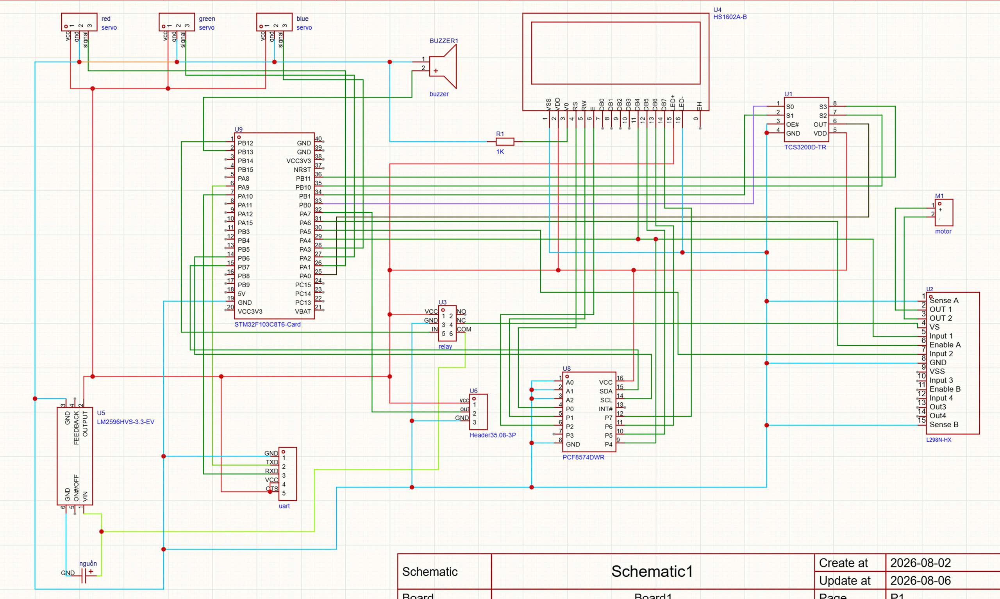

# HỆ THỐNG BĂNG CHUYỀN PHÂN LOẠI MÀU – BARE-METAL STM32

Hệ thống băng chuyền phân loại màu sắc chạy trên nền tảng STM32 theo phương pháp lập trình thanh ghi trực tiếp (Bare-metal), hoàn toàn không sử dụng thư viện HAL hay RTOS.
Dự án tập trung vào tính định thời tất định (deterministic timing), thiết kế hướng ngắt và máy trạng thái hữu hạn (Finite State Machines) cho logic cảm biến.

## 1. Tổng quan dự án

Dự án này triển khai hệ thống phân loại màu sắc tự động trên vi điều khiển STM32.
Hệ thống nhận dữ liệu màu RGB từ cảm biến TCS3200, theo dõi phôi đi qua bằng cảm biến hồng ngoại (IR) thông qua ngắt ngoài (EXTI), và điều khiển động cơ DC băng chuyền thông qua driver L298N tích hợp băm xung PWM.

Tương tác người dùng được thực hiện qua giao tiếp UART để cài đặt chỉ tiêu số lượng, trong khi hệ thống liên tục cập nhật số đếm lên màn hình LCD1602 giao tiếp I2C.
Khi đạt đủ số lượng chỉ tiêu phân loại, một relay phần cứng sẽ tự động cắt nguồn cấp 12V cho driver động cơ như một lớp dừng bảo vệ an toàn độc lập.

## 2. Mục tiêu học tập

- Thực hành lập trình Bare-metal trên STM32 không dùng thư viện HAL hay RTOS.
- Hiểu sâu về các ngoại vi EXTI, I2C, PWM (TIMERS), UART và SysTick ở cấp độ thanh ghi.
- Áp dụng máy trạng thái hữu hạn để cấu trúc hóa logic điều khiển cảm biến nhúng.
- Thiết kế vòng lặp chính (main loop) không chặn (non-blocking) sử dụng các sự kiện theo thời gian.
- Nâng cao kỹ năng viết tài liệu và tư duy hệ thống cho các dự án nhúng.

## 3. Tổng quan phần cứng

Vi điều khiển: STM32F103C8T6.

Xung nhịp: Thạch anh nội 8 MHz (mặc định, chế độ ổn định).

Hiển thị: Màn hình LCD1602 kèm module I2C PCF8574.

Thiết bị đầu vào: Cảm biến màu TCS3200 và cảm biến tiệm cận IR.

Thiết bị đầu ra: 2x Động cơ Servo SG90/MG996R, Driver động cơ L298N, Relay 5V, Còi Buzzer.

Công cụ nạp: ST-Link.

Phong cách phát triển: Bare-metal (truy cập thanh ghi trực tiếp).

## 4. Sơ đồ chân và nguyên lý

Sơ đồ nguyên lý dưới đây thể hiện việc kết nối chân giữa STM32, màn hình LCD, các cảm biến, driver động cơ và các servo.

  

## 5. Kiến trúc phần mềm

Phần mềm được xây dựng dựa trên vòng lặp chính không chặn và nhiều máy trạng thái.
Các tác vụ yêu cầu thời gian chính xác được điều khiển bởi ngắt timer, trong khi logic hệ thống duy trì sự ổn định và dễ theo dõi.
Sự tách biệt này giúp cải thiện khả năng bảo trì và dễ dàng phân tích hành vi hệ thống.

### 5.1 Máy trạng thái tổng quan hệ thống

Sơ đồ này mô tả luồng thực thi tổng thể của toàn bộ hệ thống.

  

### 5.2 Máy trạng thái logic phân loại

Sơ đồ này tập trung vào logic phân loại bên trong và các trạng thái chấp hành.
Mỗi khối trạng thái đại diện cho tập hợp các tập lệnh liên quan chịu trách nhiệm cho một hành vi cụ thể (ví dụ: phát hiện vật cản, độ trễ không chặn, điều khiển tay gạt servo).

  

## 6. Thiết kế ngắt và định thời

Ngắt phần cứng SysTick được sử dụng làm cơ sở thời gian cho hệ thống (chu kỳ ngắt 1ms).
Tín hiệu cảm biến (TCS3200) được lấy mẫu định kỳ (mỗi 20ms) thông qua máy trạng thái để đảm bảo điều khiển thời gian thực và phản hồi nhanh.
Việc đếm sản phẩm được xử lý hoàn toàn bằng ngắt phần cứng EXTI để có phản hồi tức thì.
Vòng lặp chính duy trì trạng thái không chặn và phản hồi theo các thay đổi trạng thái.
Thời gian chờ gạt servo (1000ms cho Đỏ, 2200ms cho Xanh lá) và thời gian giữ cần gạt (500ms) được tách biệt khỏi bộ điều khiển động cơ chính.
Phương pháp này đảm bảo thời gian dự đoán được và tránh các độ trễ gây treo hệ thống.

## 7. Video Demo

Video ngắn ghi lại quá trình phân loại và hoàn thành chỉ tiêu:

▶️ [Color Sorter Conveyor - Demo Video](https://www.youtube.com/watch?v=gpbj189OsZc)

## 8. Biên dịch và nạp code

Bộ công cụ biên dịch (Toolchain): arm-none-eabi-gcc.

Hệ thống build: CMake.

Mạch nạp: ST-Link.

Không sử dụng thư viện của hãng hay trình sinh mã nguồn tự động.

## 9. Tại sao lại chọn Bare-Metal?

Dự án này chủ yếu phục vụ mục đích học tập, do đó nhằm các mục tiêu:
- Hiểu sâu các ngoại vi của STM32 ở cấp độ thanh ghi.
- Nắm quyền kiểm soát hoàn toàn về mặt thời gian và luồng thực thi.
- Tránh các lớp trừu tượng ẩn và những chi phí bộ nhớ không cần thiết.
- Xây dựng nền tảng vững chắc cho việc gỡ lỗi hệ thống nhúng.

## 10. Đánh đổi hiệu năng và thời gian

Hệ thống ưu tiên tính ổn định và định thời chính xác cho việc phân loại sản phẩm.
Vì cơ cấu phân loại dựa vào độ trễ thời gian không chặn chính xác thay vì cảm biến vị trí độc lập tại mỗi máng, hệ thống có giới hạn cơ khí về tốc độ nạp phôi.
Các sản phẩm phải được đặt lên băng chuyền với khoảng cách tối thiểu từ 1.5 đến 2 giây. Nạp sản phẩm quá sát nhau sẽ khiến biến lưu trữ trạng thái bị ghi đè, dẫn đến việc servo không gạt kịp.
Hành vi này minh họa sự đánh đổi thực tế giữa sự đơn giản phần cứng (ít cảm biến hơn) và tổng thông lượng hệ thống trong thiết kế bare-metal.

## 11. Hạn chế và hướng phát triển trong tương lai

Dự án này chủ yếu mang tính chất học tập nên vẫn còn một số hạn chế:
- Chỉ tiêu số lượng được cài đặt cứng hoặc yêu cầu nhập qua UART mỗi khi reset.
- Chưa sử dụng các chế độ tiết kiệm năng lượng giữa các chu kỳ xử lý.
- Hệ thống chưa tích hợp cơ cấu cấp phôi tự động cơ khí.

Các hướng cải tiến và phát triển trong tương lai bao gồm:
- Tái cấu trúc mã nguồn để tách biệt tốt hơn giữa tầng trừu tượng phần cứng và logic phân loại.
- Tích hợp bộ nhớ EEPROM ngoài để lưu trữ chỉ tiêu khi mất nguồn.
- Chuyển đổi từ lập trình nguyên lý gốc sang các framework công nghiệp chuyên nghiệp bằng cách tích hợp ROS 2 để điều phối hệ thống nâng cao.

## 12. Tác giả

Tác giả: Huỳnh Đức Phát, Vũ Thành Đạt, Hoàng Anh